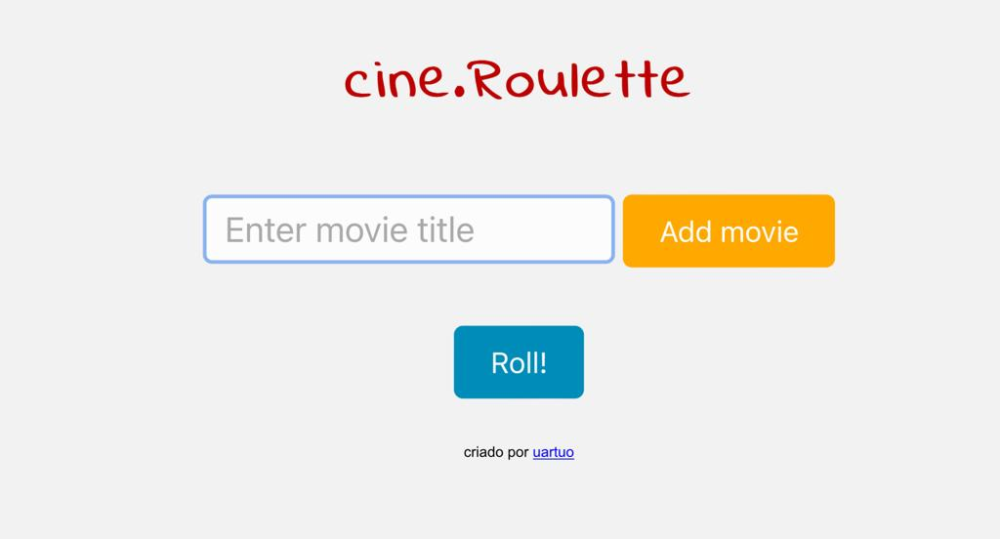

<h1 align="center"> <b>cine.Roulette</b></h1>

  

<b>cine.Roulette</b> é um aplicativo web que ajuda pessoas indecisas a escolher um filme para assistir. Com ele, é possível adicionar sugestões de filmes e deixar que o aplicativo escolha um aleatoriamente (e justamente) para vocês.  

  <a href="#-tecnologias">Tecnologias</a>&nbsp;&nbsp;&nbsp;|&nbsp;&nbsp;&nbsp;
  <a href="#-como-usar">Como usar</a>&nbsp;&nbsp;

  

 

## 💻 Tecnologias

Esse projeto foi desenvolvido com as seguintes tecnologias:

- HTML e CSS
- JavaScript
- Git e Github
    

## 🧑‍🏫 Como usar

Adicione suas sugestões de filmes clicando no botão "Add movie". Clique no botão "Roll" para deixar o CineRoulette escolher um filme para vocês assistirem.Divirta-se assistindo o filme escolhido com seus amigos!